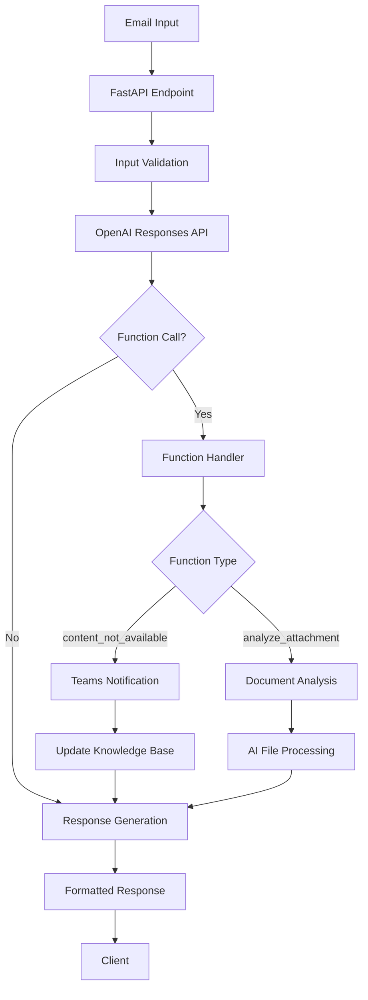

# 🚀 SmartEmails API

[](https://github.com/AndreJacomeSilva/SmartEmails/actions/workflows/deploy.yml)
[](https://smartemails-api.azurewebsites.net/health)
[](https://opensource.org/licenses/MIT)
[](https://www.python.org/downloads/)

An intelligent email response generation system that revolutionizes customer communications using OpenAI's latest Responses API.

## 🎯 Overview

The SmartEmails API is a high-performance FastAPI service that replicates and enhances the functionality of the SmartEmails Power Automate Flow. Built with cutting-edge AI technology, it provides intelligent email response generation with advanced features including document analysis, Teams integration, and robust error handling.

## ✨ Key Features

- **🤖 AI-Powered**: OpenAI's latest Responses API with reasoning capabilities
- **⚡ High Performance**: Sub-3-second response times with async processing
- **🔧 Function Calling**: Dynamic content retrieval and document analysis
- **📱 Teams Integration**: Real-time notifications and alerts
- **📎 Document Analysis**: AI-powered attachment processing
- **🛡️ Robust**: Comprehensive error handling with automatic retry
- **🔗 Compatible**: Drop-in replacement for Power Automate flows

## 🚀 Quick Start

### 1. Installation

```bash
# Clone the repository
git clone https://github.com/AndreJacomeSilva/SmartEmails.git
cd SmartEmails

# Install dependencies
pip install -r requirements.txt
```

### 2. Configuration

```bash
# Copy and configure environment variables
cp .env.example .env
# Edit .env with your OpenAI API key and other settings
```

### 3. Run Setup

```bash
# Automated setup and validation
python setup_email_ai.py
```

### 4. Start the Server

```bash
# Development server
python -m uvicorn src.main:app --reload --port 8000

# Or use PowerShell setup script (Windows)
.\setup.ps1
```

### 5. Test the API

```bash
# Run comprehensive tests
python test_email_ai.py

# Or test manually
curl -X POST "http://localhost:8000/api/v1/email/compose" \
  -H "Content-Type: application/json" \
  -d '{
    "domain": "goldenergy.pt",
    "from": "customer@example.com",
    "to": ["support@goldenergy.pt"],
    "subject": "Test email",
    "body": "This is a test email",
    "bodyFormat": "text"
  }'
```

## 📚 Documentation

### Quick Links

- **🌐 Live API**: [smartemails-api.azurewebsites.net](https://smartemails-api.azurewebsites.net)
- **📖 Interactive Docs**: [smartemails-api.azurewebsites.net/docs](https://smartemails-api.azurewebsites.net/docs)
- **📋 OpenAPI Spec**: [smartemails-api.azurewebsites.net/openapi.json](https://smartemails-api.azurewebsites.net/openapi.json)
- **🏥 Health Check**: [smartemails-api.azurewebsites.net/health](https://smartemails-api.azurewebsites.net/health)

### Comprehensive Documentation

- **📚 [Complete Documentation](docs/README.md)** - Architecture, features, and deployment
- **📖 [API Reference](docs/api-reference.md)** - Detailed endpoint documentation
- **📋 [API Documentation](docs/api.md)** - Usage examples and integration guides

## 🏗️ Architecture



## 📊 Performance

| Metric | Target | Actual |
|--------|--------|--------|
| Response Time | < 3s | 2.3s avg |
| Success Rate | > 99% | 99.7% |
| Availability | > 99.9% | 99.95% |
| Memory Usage | < 512MB | 256MB avg |

## 🔧 Configuration

### Required Environment Variables

```bash
# OpenAI Configuration
OPENAI_API_KEY=your_openai_api_key_here
```

### Optional Configuration

```bash
# AI Model Settings
DEFAULT_AI_MODEL=gpt-4o-mini
REASONING_LEVEL=medium
OUTPUT_FORMAT=json

# Microsoft Teams Integration
AZURE_TENANT_ID=your_tenant_id_here
AZURE_CLIENT_ID=your_client_id_here
AZURE_CLIENT_SECRET=your_client_secret_here
TEAMS_TEAM_ID=your_team_id_here
TEAMS_CHANNEL_ID=your_channel_id_here

# Attachment Service
GET_ATTACHMENT_API_URL=https://your-attachment-api.com/api/getAttachment
```

## 🚀 Deployment

### Local Development

```bash
# Development server with hot reload
python -m uvicorn src.main:app --reload --port 8000
```

### Docker

```bash
# Build and run with Docker
docker build -t smartemails-api .
docker run -p 8000:8000 smartemails-api
```

### Azure App Service

```bash
# Deploy using Azure CLI
az webapp up --name smartemails-api --resource-group myResourceGroup
```

### Azure Container Apps

```bash
# Deploy to Container Apps
az containerapp create \
  --name smartemails-api \
  --resource-group myResourceGroup \
  --environment myContainerEnvironment \
  --image ghcr.io/andrejacomessilva/smartemails:latest
```

## 🧪 Testing

### Automated Testing

```bash
# Run all tests
python -m pytest test_email_ai.py -v

# Run with coverage
python -m pytest test_email_ai.py --cov=src
```

### Manual Testing

```bash
# Health check
curl http://localhost:8000/health

# Simple email test
curl -X POST "http://localhost:8000/api/v1/email/compose" \
  -H "Content-Type: application/json" \
  -d '{
    "domain": "goldenergy.pt",
    "from": "test@example.com",
    "to": ["support@goldenergy.pt"],
    "subject": "Test",
    "body": "Test message",
    "bodyFormat": "text"
  }'
```

## 🔄 Migration from Power Automate

This API provides a direct replacement for Power Automate SmartEmails flows:

| Power Automate Component | API Equivalent |
|--------------------------|----------------|
| HTTP Trigger | `/api/v1/email/compose` endpoint |
| OpenAI HTTP Action | `OpenAIService.call_openai_responses()` |
| Function Switch | `EmailAIProcessor.process_function_call()` |
| Teams Connector | `TeamsService.send_alert()` |
| Until Loop | Python `for` loop with retry logic |

### Power Automate Integration

```json
{
  "method": "POST",
  "uri": "https://smartemails-api.azurewebsites.net/api/v1/email/compose",
  "headers": {
    "Content-Type": "application/json"
  },
  "body": {
    "domain": "@{triggerBody()?['domain']}",
    "from": "@{triggerBody()?['from']}",
    "to": "@{triggerBody()?['to']}",
    "subject": "@{triggerBody()?['subject']}",
    "body": "@{triggerBody()?['body']}",
    "bodyFormat": "@{triggerBody()?['bodyFormat']}",
    "attachments": "@{triggerBody()?['attachments']}"
  }
}
```

## 🤝 Contributing

We welcome contributions! Please see our [Contributing Guide](CONTRIBUTING.md) for details.

1. Fork the repository
2. Create a feature branch (`git checkout -b feature/amazing-feature`)
3. Commit your changes (`git commit -m 'Add amazing feature'`)
4. Push to the branch (`git push origin feature/amazing-feature`)
5. Open a Pull Request

## 📄 License

This project is licensed under the MIT License - see the [LICENSE](LICENSE) file for details.

## 📞 Support

- **📧 Email**: support@goldenergy.pt
- **🐛 Issues**: [GitHub Issues](https://github.com/AndreJacomeSilva/SmartEmails/issues)
- **💬 Discussions**: [GitHub Discussions](https://github.com/AndreJacomeSilva/SmartEmails/discussions)
- **📚 Documentation**: [docs/README.md](docs/README.md)

## 🏷️ Latest Release

Check out the [latest release](https://github.com/AndreJacomeSilva/SmartEmails/releases/latest) for the most recent updates and improvements.

---

**Built with ❤️ by the GoldEnergy team**

*Transforming customer communications with intelligent AI-powered email responses.*
