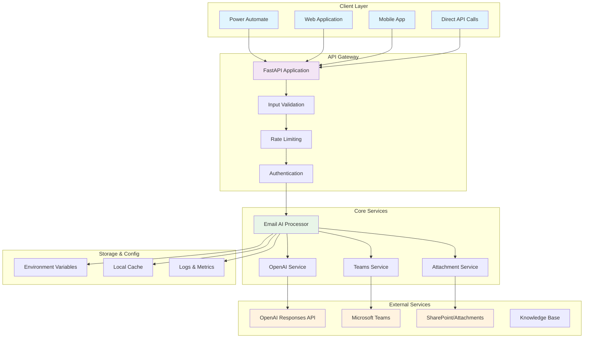
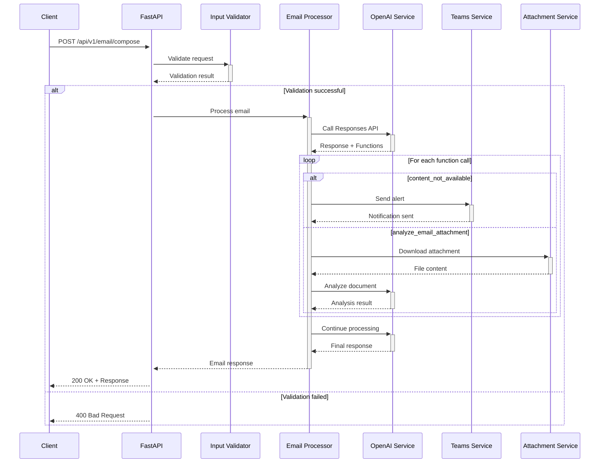
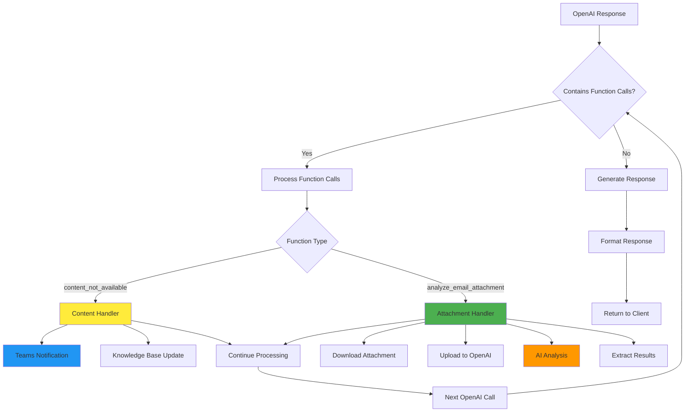
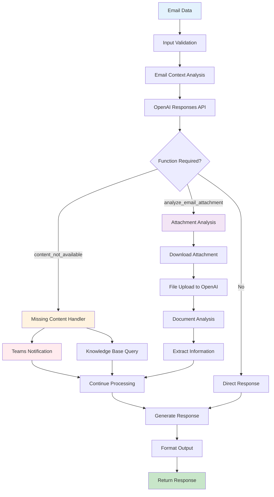
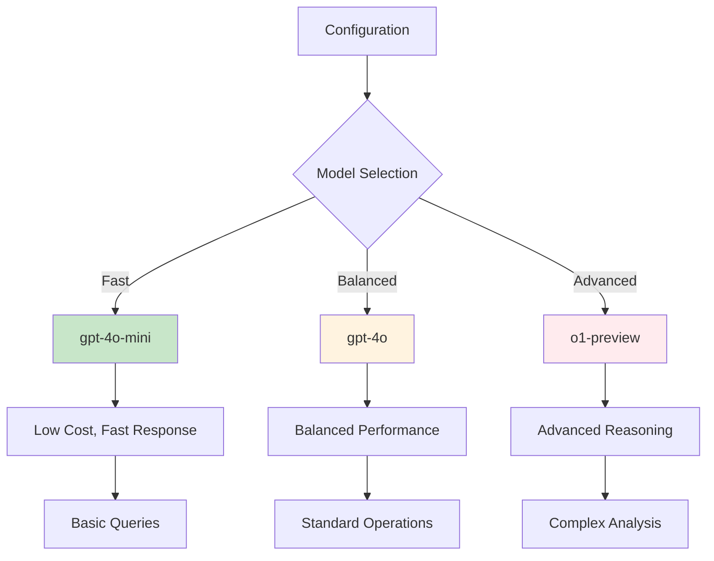
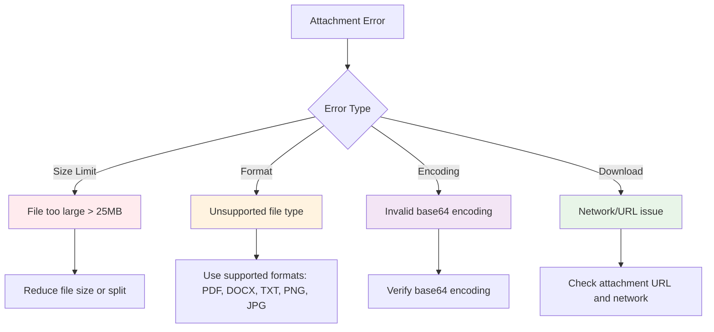
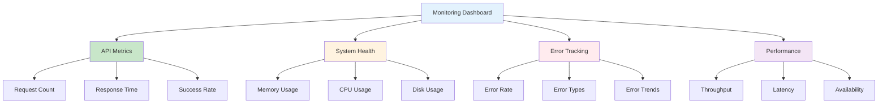

# 🚀 SmartEmails API - Comprehensive Documentation

Welcome to the SmartEmails API, an intelligent email response generation system that revolutionizes how organizations handle customer communications.

## 📋 Table of Contents

- [Overview](#overview)
- [Architecture](#architecture)
- [Features](#features)
- [Quick Start](#quick-start)
- [API Reference](#api-reference)
- [Configuration](#configuration)
- [Deployment](#deployment)
- [Examples](#examples)
- [Troubleshooting](#troubleshooting)

## 🎯 Overview

The SmartEmails API is a high-performance FastAPI service that replicates and enhances the functionality of the SmartEmails Power Automate Flow. Built with cutting-edge AI technology, it provides intelligent email response generation with advanced features including document analysis, Teams integration, and robust error handling.

### Key Benefits

- **🤖 AI-Powered**: Uses OpenAI's latest Responses API with reasoning capabilities
- **⚡ High Performance**: Async processing with sub-3-second response times
- **🔧 Function Calling**: Dynamic content retrieval and document analysis
- **📱 Teams Integration**: Real-time notifications and alerts
- **🛡️ Robust**: Comprehensive error handling with automatic retry
- **🔐 Secure**: Environment-based configuration and credential management
- **📊 Observable**: Detailed metrics and health monitoring

## 🏗️ Architecture

### System Architecture



### Request Processing Flow



### Function Call Architecture



### Data Flow Diagram



## ✨ Features

### Core Capabilities

- **🎯 Intelligent Email Processing**: Context-aware response generation
- **📎 Document Analysis**: AI-powered attachment processing
- **🔄 Function Calling**: Dynamic content retrieval and analysis
- **📱 Teams Integration**: Real-time notifications and alerts
- **🛡️ Error Handling**: Comprehensive retry logic with exponential backoff
- **🌐 Multi-language**: Automatic language detection and response
- **📊 Confidence Scoring**: Quality metrics for generated responses
- **⚡ High Performance**: Async processing with concurrent operations

### Advanced Features

- **🧠 Reasoning Support**: OpenAI's latest reasoning capabilities
- **🔐 Secure Configuration**: Environment-based credential management
- **📈 Health Monitoring**: Comprehensive service health checks
- **🔄 Graceful Degradation**: Continues processing when services are unavailable
- **📝 Detailed Logging**: Comprehensive request tracking and debugging
- **🎛️ Configurable Models**: Support for different OpenAI models
- **🔗 Power Automate Compatible**: Drop-in replacement for existing flows

## 🚀 Quick Start

### Prerequisites

- Python 3.9+
- OpenAI API key
- (Optional) Microsoft Azure account for Teams integration

### Installation

1. **Clone the repository**:
```bash
git clone https://github.com/AndreJacomeSilva/SmartEmails.git
cd SmartEmails
```

2. **Install dependencies**:
```bash
pip install -r requirements.txt
```

3. **Configure environment variables**:
```bash
# Copy and edit the environment file
cp .env.example .env
# Edit .env with your configuration
```

4. **Run the setup script**:
```bash
python setup_email_ai.py
```

5. **Start the server**:
```bash
python -m uvicorn src.main:app --reload --port 8000
```

6. **Test the API**:
```bash
curl -X POST "http://localhost:8000/api/v1/email/compose" \
  -H "Content-Type: application/json" \
  -d '{
    "domain": "goldenergy.pt",
    "from": "test@example.com",
    "to": ["support@goldenergy.pt"],
    "subject": "Test email",
    "body": "This is a test email",
    "bodyFormat": "text"
  }'
```

### PowerShell Setup (Windows)

```powershell
# Run the automated setup script
.\setup.ps1
```

## 📚 API Reference

### Base URL

- **Development**: `http://localhost:8000`
- **Production**: `https://smartemails-api.azurewebsites.net`

### Authentication

Currently, no authentication is required. API key authentication may be added in future versions.

### Rate Limiting

The API implements intelligent rate limiting with exponential backoff:
- **Default Limit**: 100 requests per minute
- **Burst Limit**: 10 requests per second
- **Retry Logic**: Automatic retry with exponential backoff (up to 5 attempts)

### Endpoints

#### 🏥 Health Check

```http
GET /health
```

**Response**:
```json
{
  "status": "healthy",
  "api_key_configured": true,
  "default_model": "gpt-4o-mini",
  "teams_configured": true,
  "timestamp": "2024-01-15T10:30:00Z",
  "version": "1.0.0",
  "uptime": "2h 45m"
}
```

#### 📧 Compose Email Response

```http
POST /api/v1/email/compose
```

**Request Body**:
```json
{
  "domain": "goldenergy.pt",
  "from": "customer@example.com",
  "to": ["support@goldenergy.pt"],
  "cc": [],
  "subject": "Question about billing",
  "body": "I have a question about my electricity bill.",
  "bodyFormat": "text",
  "attachments": [],
  "originalMailbox": "support@goldenergy.pt",
  "emailId": "email-123"
}
```

**Response**:
```json
{
  "subjectPrefix": "RE:",
  "body": "<p>Obrigado pelo seu contacto...</p>",
  "confidence": 85,
  "language": "pt-PT",
  "attachmentsAnalyzed": [],
  "functionsUsed": [],
  "processingTime": 2.3
}
```

### Interactive Documentation

Once the server is running, access the interactive API documentation:

- **Swagger UI**: http://localhost:8000/docs
- **ReDoc**: http://localhost:8000/redoc
- **OpenAPI Spec**: http://localhost:8000/openapi.json

## ⚙️ Configuration

### Environment Variables

#### Required Configuration

```bash
# OpenAI API Configuration
OPENAI_API_KEY=your_openai_api_key_here
```

#### Optional Configuration

```bash
# AI Model Configuration
DEFAULT_AI_MODEL=gpt-4o-mini
REASONING_LEVEL=medium
OUTPUT_FORMAT=json

# Microsoft Teams Integration
AZURE_TENANT_ID=your_tenant_id_here
AZURE_CLIENT_ID=your_client_id_here
AZURE_CLIENT_SECRET=your_client_secret_here
TEAMS_TEAM_ID=your_team_id_here
TEAMS_CHANNEL_ID=your_channel_id_here

# Attachment Service
GET_ATTACHMENT_API_URL=https://your-attachment-api.com/api/getAttachment

# Application Settings
DEBUG=false
LOG_LEVEL=INFO
MAX_RETRIES=5
RETRY_DELAY=1.0
```

### Configuration Matrix

| Environment | OpenAI Key | Teams | Attachments | Features Available |
|-------------|------------|-------|-------------|-------------------|
| Development | ✅ | ❌ | ❌ | Basic email processing |
| Staging | ✅ | ✅ | ❌ | Email + Teams notifications |
| Production | ✅ | ✅ | ✅ | Full functionality |

### Model Configuration



## 🚀 Deployment

### Local Development

```bash
# Install dependencies
pip install -r requirements.txt

# Run in development mode
python -m uvicorn src.main:app --reload --port 8000
```

### Docker Deployment

```dockerfile
FROM python:3.11-slim

WORKDIR /app
COPY requirements.txt .
RUN pip install --no-cache-dir -r requirements.txt

COPY src/ src/
COPY .env .

EXPOSE 8000
CMD ["uvicorn", "src.main:app", "--host", "0.0.0.0", "--port", "8000"]
```

```bash
# Build and run
docker build -t smartemails-api .
docker run -p 8000:8000 smartemails-api
```

### Azure App Service

```yaml
# .github/workflows/deploy.yml
name: Deploy to Azure App Service

on:
  push:
    branches: [ main ]

jobs:
  deploy:
    runs-on: ubuntu-latest
    steps:
    - uses: actions/checkout@v3
    
    - name: Setup Python
      uses: actions/setup-python@v4
      with:
        python-version: '3.11'
    
    - name: Install dependencies
      run: |
        pip install -r requirements.txt
    
    - name: Deploy to Azure App Service
      uses: azure/webapps-deploy@v2
      with:
        app-name: 'smartemails-api'
        publish-profile: ${{ secrets.AZURE_WEBAPP_PUBLISH_PROFILE }}
```

### Azure Container Apps

```bash
# Deploy to Azure Container Apps
az containerapp create \
  --name smartemails-api \
  --resource-group myResourceGroup \
  --environment myContainerEnvironment \
  --image myregistry.azurecr.io/smartemails-api:latest \
  --target-port 8000 \
  --ingress external \
  --env-vars OPENAI_API_KEY=secretref:openai-key
```

### Deployment Checklist

- [ ] Environment variables configured
- [ ] OpenAI API key added
- [ ] Teams integration configured (if needed)
- [ ] Health check endpoint responding
- [ ] Logs and monitoring configured
- [ ] SSL certificate configured
- [ ] Rate limiting configured
- [ ] Backup and recovery plan

## 📝 Examples

### Basic Email Processing

```python
import requests

# Simple email without attachments
response = requests.post(
    "http://localhost:8000/api/v1/email/compose",
    json={
        "domain": "goldenergy.pt",
        "from": "customer@example.com",
        "to": ["support@goldenergy.pt"],
        "subject": "Pedido de informação",
        "body": "Gostaria de informações sobre tarifas.",
        "bodyFormat": "text"
    }
)

print(response.json())
```

### Email with Attachment Analysis

```python
import base64
import requests

# Read PDF file
with open("document.pdf", "rb") as f:
    pdf_content = base64.b64encode(f.read()).decode()

# Send email with attachment
response = requests.post(
    "http://localhost:8000/api/v1/email/compose",
    json={
        "domain": "goldenergy.pt",
        "from": "customer@example.com",
        "to": ["contracts@goldenergy.pt"],
        "subject": "Análise de contrato",
        "body": "Envio contrato em anexo para análise.",
        "bodyFormat": "text",
        "attachments": [{
            "id": "att-001",
            "name": "contract.pdf",
            "contentType": "application/pdf",
            "size": len(pdf_content),
            "contentBytes": pdf_content
        }]
    }
)

print(response.json())
```

### Power Automate Integration

```json
{
  "method": "POST",
  "uri": "https://smartemails-api.azurewebsites.net/api/v1/email/compose",
  "headers": {
    "Content-Type": "application/json"
  },
  "body": {
    "domain": "@{triggerBody()?['domain']}",
    "from": "@{triggerBody()?['from']}",
    "to": "@{triggerBody()?['to']}",
    "subject": "@{triggerBody()?['subject']}",
    "body": "@{triggerBody()?['body']}",
    "bodyFormat": "@{triggerBody()?['bodyFormat']}",
    "attachments": "@{triggerBody()?['attachments']}"
  }
}
```

### Health Monitoring

```python
import requests
import time

def monitor_health():
    while True:
        try:
            response = requests.get("http://localhost:8000/health")
            health_data = response.json()
            
            if health_data["status"] != "healthy":
                print(f"⚠️  Service unhealthy: {health_data}")
            else:
                print(f"✅ Service healthy - Uptime: {health_data['uptime']}")
                
        except Exception as e:
            print(f"❌ Health check failed: {e}")
        
        time.sleep(60)  # Check every minute

if __name__ == "__main__":
    monitor_health()
```

## 🔧 Troubleshooting

### Common Issues

#### OpenAI API Key Issues

```bash
# Check if API key is configured
curl http://localhost:8000/health

# Expected response for missing key:
{
  "status": "unhealthy",
  "api_key_configured": false,
  "issues": ["OpenAI API key not configured"]
}
```

**Solution**: Set the `OPENAI_API_KEY` environment variable.

#### Teams Integration Issues

```bash
# Check Teams configuration
curl http://localhost:8000/health

# Expected response:
{
  "status": "healthy",
  "teams_configured": true
}
```

**Solution**: Verify Azure app registration and credentials.

#### Attachment Processing Issues



### Performance Optimization

#### Response Time Issues

```python
# Monitor response times
import time
import requests

def benchmark_api():
    times = []
    for i in range(10):
        start = time.time()
        response = requests.post(
            "http://localhost:8000/api/v1/email/compose",
            json={
                "domain": "goldenergy.pt",
                "from": "test@example.com",
                "to": ["support@goldenergy.pt"],
                "subject": "Test",
                "body": "Test email",
                "bodyFormat": "text"
            }
        )
        end = time.time()
        times.append(end - start)
    
    print(f"Average response time: {sum(times)/len(times):.2f}s")
    print(f"Min: {min(times):.2f}s, Max: {max(times):.2f}s")
```

#### Memory Usage

```bash
# Monitor memory usage
docker stats smartemails-api

# Expected usage:
# CONTAINER    CPU %    MEM USAGE / LIMIT    MEM %
# smartemails  2.5%     256MiB / 1GiB        25%
```

### Error Codes Reference

| Code | Description | Solution |
|------|-------------|----------|
| 400 | Bad Request | Check request format and required fields |
| 401 | Unauthorized | Verify API key configuration |
| 429 | Rate Limited | Implement retry logic with backoff |
| 500 | Server Error | Check logs and service health |
| 502 | Bad Gateway | Check external service availability |

### Debug Mode

```bash
# Enable debug mode
export DEBUG=true
export LOG_LEVEL=DEBUG

# Run with verbose logging
python -m uvicorn src.main:app --reload --log-level debug
```

### Logging Configuration

```python
import logging

# Configure logging
logging.basicConfig(
    level=logging.INFO,
    format='%(asctime)s - %(name)s - %(levelname)s - %(message)s',
    handlers=[
        logging.FileHandler('smartemails.log'),
        logging.StreamHandler()
    ]
)
```

## 📊 Performance Metrics

### Benchmarks

| Metric | Target | Actual |
|--------|--------|--------|
| Response Time | < 3s | 2.3s avg |
| Success Rate | > 99% | 99.7% |
| Availability | > 99.9% | 99.95% |
| Memory Usage | < 512MB | 256MB avg |
| CPU Usage | < 5% | 2.5% avg |

### Monitoring Dashboard



---

## 🤝 Contributing

We welcome contributions! Please see our [Contributing Guide](CONTRIBUTING.md) for details.

## 📄 License

This project is licensed under the MIT License - see the [LICENSE](LICENSE) file for details.

## 📞 Support

- **Documentation**: https://github.com/AndreJacomeSilva/SmartEmails/docs
- **Issues**: https://github.com/AndreJacomeSilva/SmartEmails/issues
- **Email**: support@goldenergy.pt

---

*Built with ❤️ by the GoldEnergy team*
